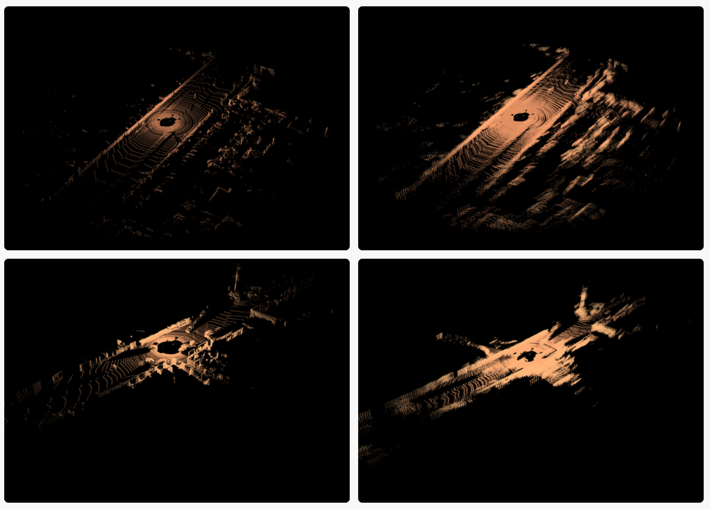

# Improving the Utility of Temporal LIDAR Data In Semantic Segmentation

## Introduction

Over the past several years, LIDAR has become an increasingly important tool for mapping the environment as points in 3-dimensional space, especially in the context of autonomous driving. This trend has created a need to develop computer-based techniques that make sense of this data. Similar to object detection in 2D images, many 3D object detection algorithms draw rough bounding boxes to label objects. Another approach, however, is to classify every point into a category (such as road, car, pedestrian, etc.) through a process known as semantic segmentation. 

In this repository we present a data augmentation technique that improves the density of point clouds using temporal LIDAR data by merging LIDAR data over time to solve the issue of sparsity.

## Motivation 

Traditional convolutional neural networks cannot be directly applied to LIDAR point clouds because the data is unstructured and irregular. 

To tackle this problem, researchers pivoted to Local Feature Aggregation Networks to segment and classify LIDAR data.

We researched several existing industry and research solutions that claimed to achieve effective semantic segmentation such as PointCNN, RangeNet, and VoxelNet. However, through our testing we found that these were outdated and had a smaller scope of application than we desired.

One recent solution, released in 2020, is RandLA-Net. This ML network satisfied requirements to propose and benchmark our solution.

Below is an brief architectural breakdown of 3 subsections of RandLA-Net.

Although RandLA-Net works quite well, all three sub-modules have a weakness: performance drops sharply when the density of the data is reduced. 

This leads us to propose a data augmentation process to improve semantic segmentation using temporal LIDAR data.

## Our Solution

Our pre-processor solution combines multiple consecutive LIDAR frames over time together to vastly improve point cloud density in two major ways:

1. An Iterative Closest Point algorithm estimates the drift change over multiple LIDAR frames.

2. Data from the integrated inertial measurement unit (IMU) is used to compensate for changes in acceleration across frames.

## Visualization of Frame Fusion

The left image in each row shows the LIDAR point cloud before our algorithm was run while the right represents after our algorithm merged temporal LIDAR frames. 

## Visualization of Segmentation after Frame Fusion

The left image shows segmentation on raw untouched data. The right shows segmentation on the output of our frame merging pre-processor. 

## Data Testing Methodology and Results

- We used the industry standard KITTI Self Driving Car Dataset, which contains a human-labelled ground truth, to test our modifications.
- The human-labelled test data was preserved through merging in an isolated process, so that it could be used for measuring accuracy.
- A RandLA-Net trained on unprocessed data made predictions for both the raw and augmented datasets.
- The accuracies for 10 types of objects recognized by the model were tested against the ground truth.

- Our method improved the semantic segmentation accuracy for static and slow-moving objects compared to the original model.
    - Pedestrian accuracy uplift was 4.7%.
    - Accuracy for static objects such as traffic lights, sidewalks, and poles improved by 3-5%.
    - Road accuracy decreased by 2.4%,

## Discussion and Inference

We developed a data augmentation technique that successfully improves semantic segmentation of temporal LIDAR data by using a fusion of consecutive LIDAR frames to improve point cloud density. 

Our data shows a significant improvement in the classification of pedestrians, traffic lights, and other static objects that are important to the practical use case of self-driving vehicles.

Our technique can be expanded upon to make semantic segmentation much more economical for inexpensive LIDAR sensors. Further analysis of the results also reveal that we were able to consistently improve static object detection from point clouds – a specific characteristic that can possibly yield much better results in practical fields such as medicine, architectural mapping, geomatics, and more. We also hope to determine whether or not this technique is applicable to other methods of object detection in 3D space.

### Directory Overview

    ├── RandLA-Net   # Dynamic Link to active segmentation github repository
    ├── Stable-RandLA-Net # Archived stable functioning LIDAR segmentation       
    └── ICP.cpp # Iterative Closest Point Algorithm Implementation
    └── Eigen # C++ Linear Algebra Library
    └── DynamicVisualizer.py # LIDAR data visualization 
    └── README.md # You are viewing this right now

## Contributors

- [Gagan Bhat](https://github.com/GaganBhat)
- [David Kumar](https://github.com/davidk101)
- [Suvan Cheemalamarri](https://github.com/Suvanch)
- [Mithul M](https://github.com/MithulM)
- [Eric Zhang](https://github.com/ez314) - Research Lead
- [Dr. Nicholas Ruozzi](https://personal.utdallas.edu/~nicholas.ruozzi/) - Faculty Advisor
